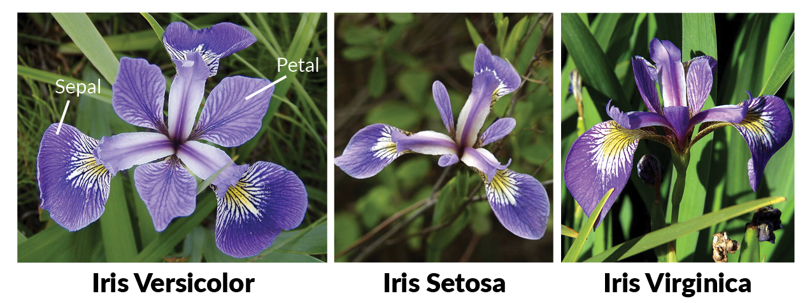

```{r setup, include = FALSE}
library("xtable")
library("stargazer")
data(iris)
```

***

## Description

This famous dataset [@fisher, @anderson] gives the measurements in centimeters of the variables sepal length and width and petal length and width, respectively, for 50 flowers from each of 3 species of iris. The species are *Iris setosa, verscolor*, and *virginica*. 




```{r summary, echo = FALSE, results = TRUE}
summary(iris)
```


## References
