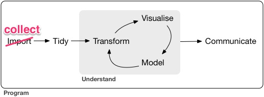
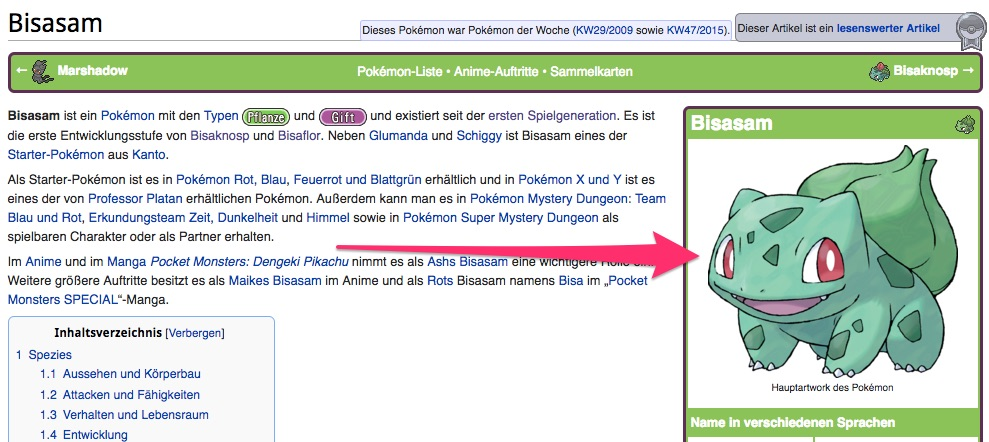
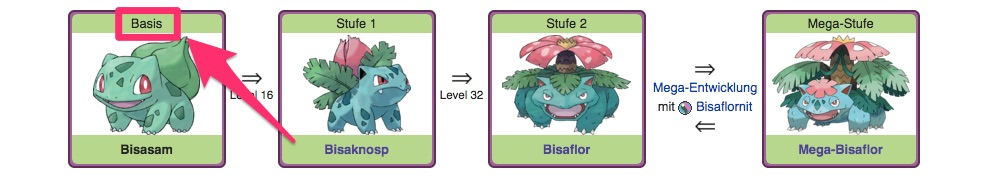

```{r setup, include=FALSE}
knitr::opts_chunk$set(echo = TRUE)
```

## Webscraping in the project workflow

```{r project-flow-rvest, out.width="100%",fig.cap="Flow of a typical data science project - source: http://r4ds.had.co.nz/introduction.html", echo=FALSE} 
 
```

To showcase this we are going to build the data set `pokemon_raw.csv` we used yesterday during my `tidyverse` presentation.

We will use the `tidyverse` standard-packages and the `rvest` package which is also part of the tidyverse:

```{r loading-the-tidyverse}
library(tidyverse)
library(rvest)
```

## HTML = XML 

Live visualisation of the Chrome developer toolbar and selector gadget

http://selectorgadget.com/

## Get links we want to scrape

```{r}
pokewiki_url <- "https://www.pokewiki.de/Pok%C3%A9mon-Liste"

# Download and parse the html-website
overview <- read_html(pokewiki_url)

pokemon <- overview %>%
  html_nodes("td:nth-child(3) a") %>% 
  {tibble(german = html_attr(., "title"), path = html_attr(., "href"))} %>% 
  mutate(
    path = xml2::url_absolute(path, pokewiki_url),
    rn = row_number()
    )

pokemon
```

## Build scraper for Pokemon generation

I always start with one website I want to scrape and generalize later on:

```{r}
x <- read_html("https://www.pokewiki.de/Bisasam")

x %>% 
  html_node("h3+ .zentriert.c") %>% 
  # html_node takes the first node it finds. html_nodes takes all
  html_node("td") %>% 
  html_text(trim = TRUE)
```

Save this procedure as a function:

```{r}
scrape_poke_generation <- function(x){
  x %>% 
    html_node("h3+ .zentriert.c") %>% 
    html_node("td") %>% 
    html_text(trim = TRUE)
}
```

## Build scraper for Pokemon attributes

```{r}
x <- read_html("https://www.pokewiki.de/Bisasam")

# Extract the table
# CSS selector found via selectorgadget
dat <- x %>% html_node(".innerround") %>% html_table

# What rows to scrape
poke_attr <- c("Englisch$", "Typ$|Typen$", "Geschlecht$", "Gewicht$","Größe$", "EP Lv. 100$", "Farbe$")
# How to name them. The order must match the above one!!!
col_names <- c("english", "types", "gender", "weight","size", "ep_to_100", "color")

# Index of the rows to scrape
poke_attr_ind <- map(poke_attr, ~stringr::str_detect(dat[["X1"]], .)) %>% map_int(which)

# Transform the Table to get a 1xM tibble that contains the data
dat %>% 
    slice(poke_attr_ind) %>% 
    # rename the labels - while in long format
    mutate(X1 = col_names) %>%
    # transpose the data
    spread(X1, X2)
```

Save this procedure as a function:

```{r}
scrape_poke_attr <- function(x){
  # What rows to scrape
  poke_attr <- c("Englisch$", "Typ$|Typen$", "Geschlecht$", "Gewicht$","Größe$", "EP Lv. 100$", "Farbe$")
  # How to name them. The order must match the above one!!!
  col_names <- c("english", "types", "gender", "weight","size", "ep_to_100", "color")
  # Extract the table
  dat <- x %>% html_node(".innerround") %>% html_table
  # Which rows contain the data?
  poke_attr_ind <- map(poke_attr, ~stringr::str_detect(dat[["X1"]], .)) %>% map_int(which)
  dat %>% 
    slice(poke_attr_ind) %>% 
    # rename the labels - while in long format
    mutate(X1 = col_names) %>%
    # transpose the data
    spread(X1, X2)
}
```

## Build scraper for Pokemon statistics (speed, hp, ...)

```{r}
x <- read_html("https://www.pokewiki.de/Bisasam")

  # scrape the table
x %>% 
    html_node(".lastisroundtable") %>% 
    html_table(fill = TRUE, header = TRUE) %>% 
    # set unique names - the tables is not propperly formatted => This is needed
    set_tidy_names(quiet = TRUE) %>% 
    # select only the base data of the Pokemon
    select(Statuswerte, Basiswerte) %>% 
    slice(2:7) %>% 
    # transpose the data
    spread(Statuswerte, Basiswerte) %>% 
    # rename the data - while in wide format
    rename(hp = "KP",
           attack = "Angriff",
           defense = "Vert.",
           speed = "Init.",
           attack_special = `Spez.-Angr.`,
           defense_special = `Spez.-Vert.`) %>% 
    # convert all columns to integer
    mutate_all(parse_integer)
```

Save this procedure as a function:

```{r}
scrape_poke_stats <- function(x){
  # scrape the table
  x %>% 
    html_node(".lastisroundtable") %>% 
    html_table(fill = TRUE, header = TRUE) %>% 
    # set unique names - the tables is not propperly formatted => This is needed
    set_tidy_names(quiet = TRUE) %>% 
    # select only the base data of the Pokemon
    select(Statuswerte, Basiswerte) %>% 
    slice(2:7) %>% 
    # transpose the data
    spread(Statuswerte, Basiswerte) %>% 
    # rename the data - while in wide format
    rename(hp = "KP",
           attack = "Angriff",
           defense = "Vert.",
           speed = "Init.",
           attack_special = `Spez.-Angr.`,
           defense_special = `Spez.-Vert.`) %>% 
    # convert all columns to integer
    mutate_all(parse_integer)
}
```

## Combine the scraper:

```{r}
pokemon <- pokemon %>% 
  # Only take the 3 starter Pokemon and their evolutions
  head(9) %>% 
  # Read in the website (= download and parse the website)
  mutate(doc = map(path, read_html)) %>% 
  # Scrape the attributes per row/pokemon
  mutate(poke_attr = map(doc, scrape_poke_attr)) %>% 
  # Scrape the statistics (strength etc) per row/pokemon
  mutate(poke_stats = map(doc, scrape_poke_stats)) %>% 
  # Scrape the generation that the Pokemon was introduced
  mutate(generation = map_chr(doc, scrape_poke_generation))

pokemon
```

Drop the raw html and unnest the data

```{r}
pokemon %>% 
  select(-doc) %>% 
  unnest
```

Exercise

* Scrape the french name of the pokemon

* Extract the href (url) of the Pokemon image:
```{r poke-img, out.width="100%",fig.cap="Pokemon image - source: https://www.pokewiki.de/Bisasam", echo=FALSE} 
 
```

* HARD: Write a scraper that extracts the evolution of the pokemon
```{r evolution-lvl, out.width="100%",fig.cap="Evolution lvl of the Pokemon - source: https://www.pokewiki.de/Bisasam", echo=FALSE} 
 
```
